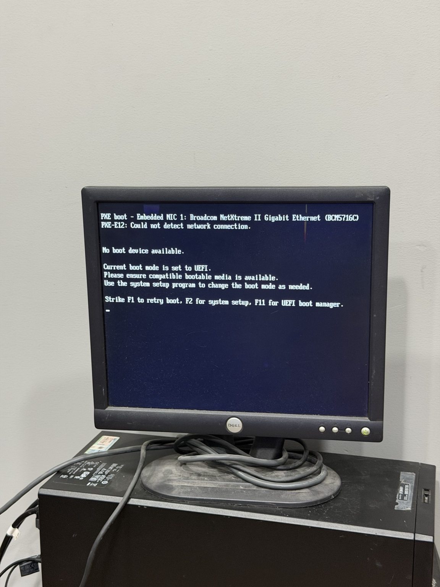
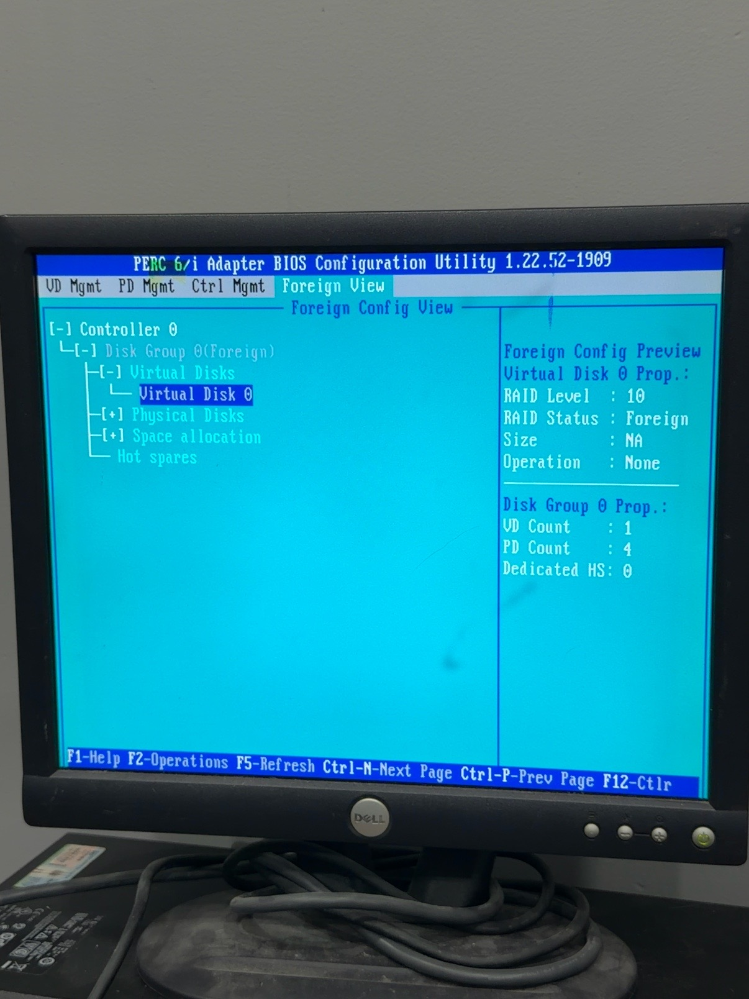
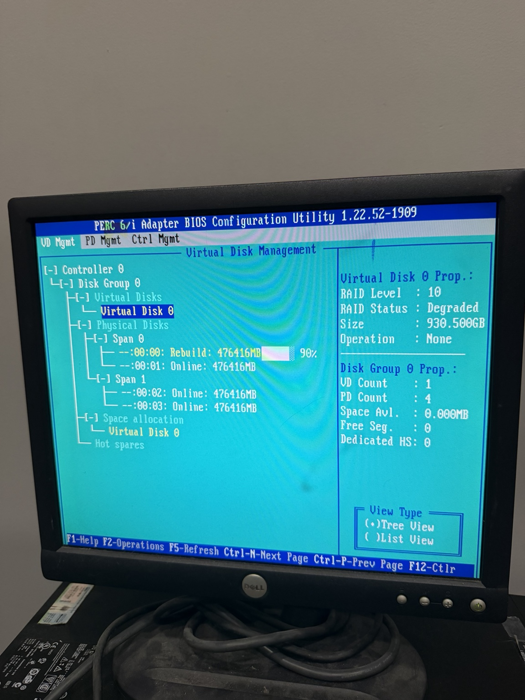

# Dell PowerEdge T310: Boot and RAID Recovery

**Status:** Boot restored; RAID 10 rebuild completed. Full system health assessment pending.

## Overview

I brought an older Dell PowerEdge T310 back to a bootable state and recovered its existing RAID configuration. The machine initially reported that no boot device was available. After troubleshooting the boot mode and its PowerEdge RAID Controller (PERC), I imported the foreign configuration and booted the existing Windows installation in UEFI mode. PERC then rebuilt the degraded array automatically and subsequently showed all four disks online with the array no longer degraded.

This work restored access to the system and the array. It does not, by itself, establish the long-term health of the disks or the suitability of the machine for a permanent lab role.

## Hardware and storage

| Component | Observed configuration |
| --- | --- |
| System | Dell PowerEdge T310 |
| PERC model | Dell PERC 6/i |
| Physical storage | Four 500 GB hard drives |
| RAID configuration | RAID 10 |
| Usable array capacity | Approximately 1 TB reported to Windows |
| Operating system | Windows 10 Pro, version 1803 (build 17134); UEFI boot |

## Recovery timeline

1. **Boot failure:** The T310 displayed “No boot device available.”
2. **Boot and storage inspection:** I explored the legacy BIOS setting and checked storage settings. With legacy boot enabled, PERC showed no active RAID configuration and identified physical disks as foreign.
3. **Configuration import:** I imported the foreign RAID configuration through PERC. The first boot attempt still failed.
4. **Boot restored:** I returned the system to UEFI boot mode, after which the existing Windows installation started successfully.
5. **Degraded array identified:** PERC reported a degraded disk, identified during the work as disk 0.
6. **Automatic rebuild:** PERC began rebuilding the array automatically; I did not manually start the rebuild.
7. **Final storage state:** After the rebuild, PERC reported all four disks online and functional, and the array was no longer degraded. Windows continued to boot.

## Selected evidence

The initial boot attempt stopped at the UEFI “No boot device available” message.

PERC identified one foreign disk group with four physical disks in RAID 10.

During recovery, the RAID 10 virtual disk was still marked degraded while disk 0 rebuilt. The screen shows the rebuild at 90%; the later non-degraded state was confirmed separately.

## Result and interpretation

The boot failure was resolved by importing the foreign RAID configuration and returning to UEFI boot mode. The RAID 10 array recovered from a degraded state and finished rebuilding. These are PERC and boot observations; they do not yet confirm disk SMART health, memory reliability, backup recoverability, or sustained workload stability.

## Next assessment

Before assigning this machine a permanent lab role, I plan to record the exact disk models and PERC details, review PERC and system logs, run available hardware diagnostics, check the operating system and storage events, and test backup and restore options. The keep-or-retire decision remains open until that assessment is complete.
