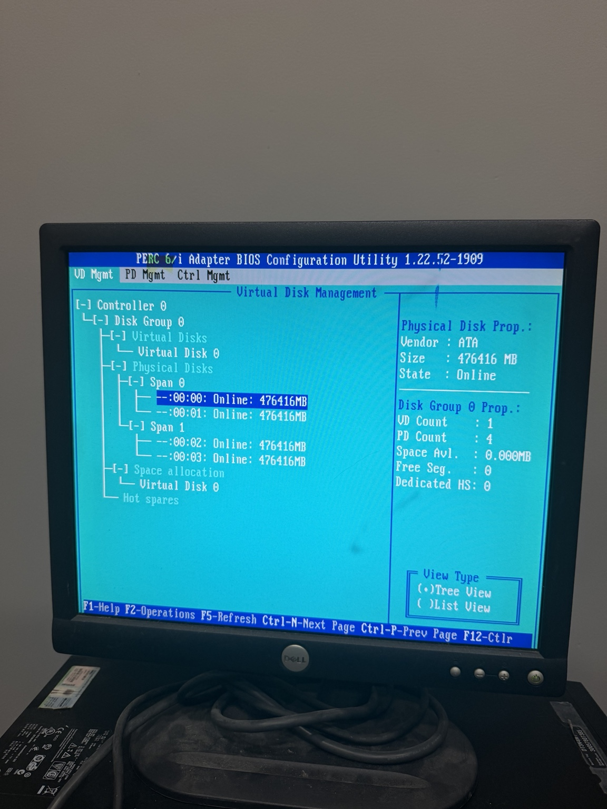
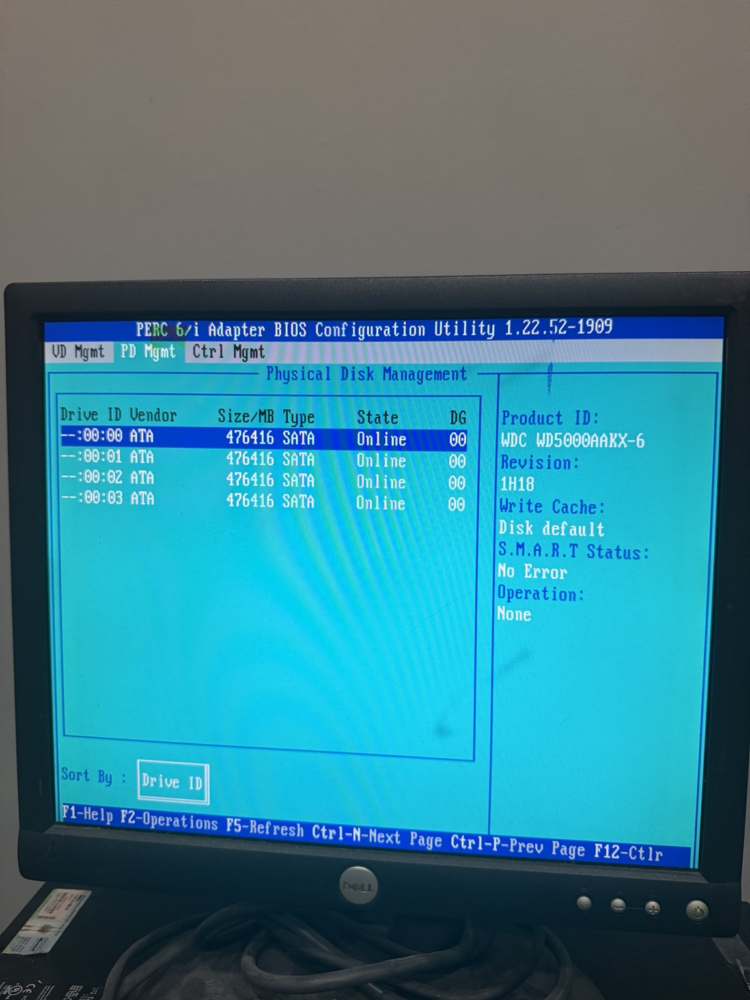

# Dell PowerEdge T310: Boot and RAID Recovery

**Status:** Boot restored; RAID 10 optimal; initial health checks passed. Backup and extended testing pending.

## Overview

I received this Dell PowerEdge T310 from a peer and began assessing whether it was worth keeping for my home lab. The first step was to establish whether it could boot, recover its storage configuration, and pass basic health checks before assigning it a role.

I brought an older Dell PowerEdge T310 back to a bootable state and recovered its existing RAID configuration. The machine initially reported that no boot device was available. After troubleshooting the boot mode and its PowerEdge RAID Controller (PERC), I imported the foreign configuration and booted the existing Windows installation in UEFI mode. PERC then rebuilt the degraded array automatically and subsequently showed all four disks online with the array no longer degraded.

This work restored access to the system and the array. It does not, by itself, establish the long-term health of the disks or the suitability of the machine for a permanent lab role.

## Hardware and storage

| Component | Observed configuration |
| --- | --- |
| System | Dell PowerEdge T310 |
| PERC model | Dell PERC 6/i |
| Physical storage | Four 500 GB hard drives |
| RAID configuration | RAID 10 |
| Usable array capacity | Approximately 1 TB reported to Windows |
| Operating system | Windows 10 Pro, version 1803 (build 17134); UEFI boot |

## Recovery timeline

1. **Boot failure:** The T310 displayed “No boot device available.”
2. **Boot and storage inspection:** I explored the legacy BIOS setting and checked storage settings. With legacy boot enabled, PERC showed no active RAID configuration and identified physical disks as foreign.
3. **Configuration import:** I imported the foreign RAID configuration through PERC. The first boot attempt still failed.
4. **Boot restored:** I returned the system to UEFI boot mode, after which the existing Windows installation started successfully.
5. **Degraded array identified:** PERC reported a degraded disk, identified during the work as disk 0.
6. **Automatic rebuild:** PERC began rebuilding the array automatically; I did not manually start the rebuild.
7. **Final storage state:** After the rebuild, PERC reported all four disks online and functional, and the array was no longer degraded. Windows continued to boot.

## Selected evidence

The initial boot attempt stopped at the UEFI “No boot device available” message.

PERC identified one foreign disk group with four physical disks in RAID 10.

During recovery, the RAID 10 virtual disk was still marked degraded while disk 0 rebuilt. The screen shows the rebuild at 90%; the later non-degraded state was confirmed separately.

## Result and interpretation

The boot failure was resolved by importing the foreign RAID configuration and returning to UEFI boot mode. The RAID 10 array recovered from a degraded state and finished rebuilding. Initial disk, memory, and Windows event checks have since been completed, but backup recoverability and sustained workload stability remain untested.

## Initial health assessment

After the rebuild, PERC showed all four physical disks online. I checked each disk in PERC and found no reported S.M.A.R.T. errors. The photo below shows the four online disks; the next shows “No Error” for the selected disk.

Windows Memory Diagnostic completed two passes without a reported problem. A photo captured the test at 99% of its second pass; completion is based on my observed result rather than that photo.

I reviewed Windows System events and found no notable disk, file system, or hardware errors. The unexpected-shutdown entries corresponded to times when I disconnected the power cable.

These checks support further use of the T310 for testing, but I have not assigned it a permanent home lab role.

## Remaining evaluation

The T310 boots reliably in the checks completed so far, and PERC currently reports four online disks. Before assigning it a permanent lab role, I plan to review PERC event history, test a backup and restore, and monitor disk state and Windows events during an extended workload. I’ll then weigh its reliability, power use, and noise against its usefulness in the lab. The keep-or-retire decision remains open.
