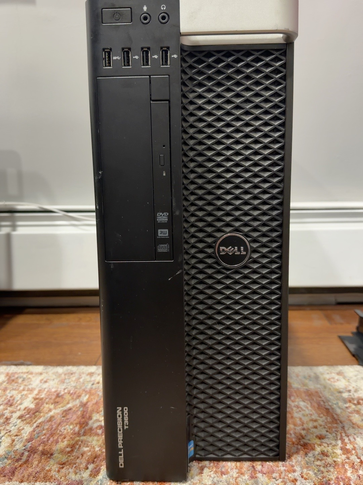

# Dell Precision T3600: No-Display Troubleshooting

**Status:** Powers on, but display output remains unresolved. Troubleshooting paused pending direct display cabling.

## Overview

I began assessing this Dell Precision T3600 as a possible home lab workstation. It arrived without a graphics card. Installing an NVIDIA T600 allowed me to begin testing, but the system did not produce a display. This assessment records the tests completed so far; a successful boot and a permanent lab role have not been established.

## Hardware observed during assessment

| Component | Observed details |
| --- | --- |
| System | Dell Precision T3600 |
| Memory | Initially four 4 GB DDR3 DIMMs: two PC3-10600 DDR3-1333 and two PC3-12800 DDR3-1600; the slower pair was removed during troubleshooting |
| Storage | One 250 GB HDD; health and contents not yet verified |
| Optical drive | Present |
| Graphics tested | NVIDIA T600 and NVIDIA NVS 300 |
| Processor | Not yet verified |

The graphics cards listed above describe the troubleshooting tests, rather than a finalized workstation configuration.

## Troubleshooting timeline

1. **Initial power-on:** The fans spun, but there was no display. The power indicator was solid white, and diagnostic LEDs 1, 2, and 3 were observed.
2. **Memory isolation:** I removed the slower pair of DIMMs, leaving two 4 GB modules in DIM1 and DIM2. This did not establish a working display.
3. **T600 testing:** I reseated the T600 and tested it in several PCIe slots. Slot 5 cleared the previously observed 1–2–3 indication, but there was still no display.
4. **Alternate graphics card:** I tested an NVIDIA NVS 300 in PCIe slot 2. The system initially showed no diagnostic indication for roughly one to two minutes, after which LEDs 1–2–3 appeared and disappeared intermittently.
5. **Display connection:** The NVS 300 test used a DMS-59-to-DVI adapter followed by a DVI-to-DisplayPort cable. That connection path has not been verified with a known-good direct cable.
6. **Pause:** I planned to obtain a direct DMS-59 display cable before continuing the assessment.

## Result and interpretation

The workstation powers on, but I have not obtained video output. Changes in the diagnostic LEDs during graphics-card testing did not confirm a successful boot or isolate a failed component. The display connection remains an unresolved variable, so I have not concluded that either graphics card or the motherboard is faulty.

## Next assessment

The next test is a direct connection from the NVS 300 to a compatible monitor. A successful display would allow BIOS inspection and further hardware checks. CPU identification, disk health, operating-system status, and suitability for a home lab role remain open.
