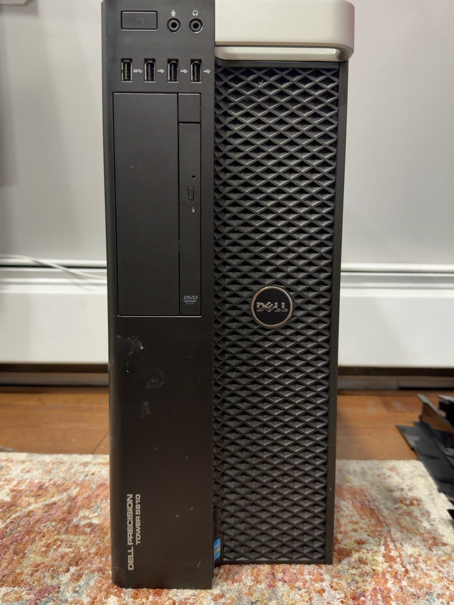
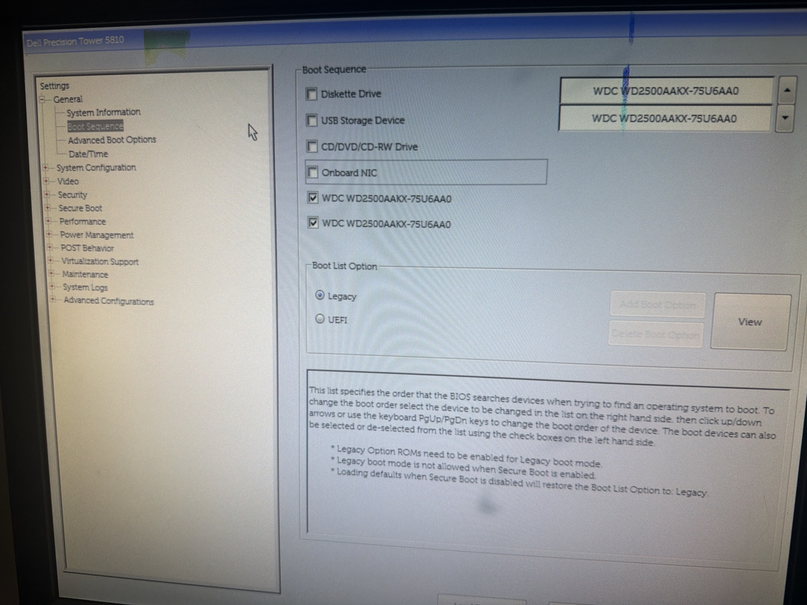
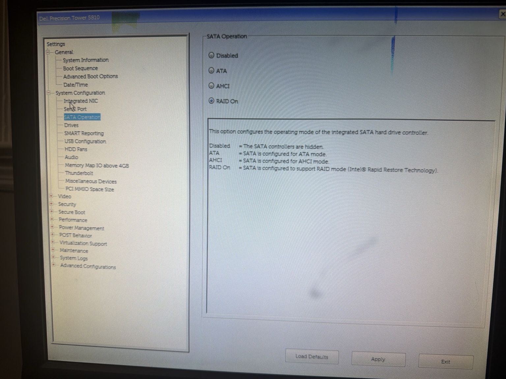
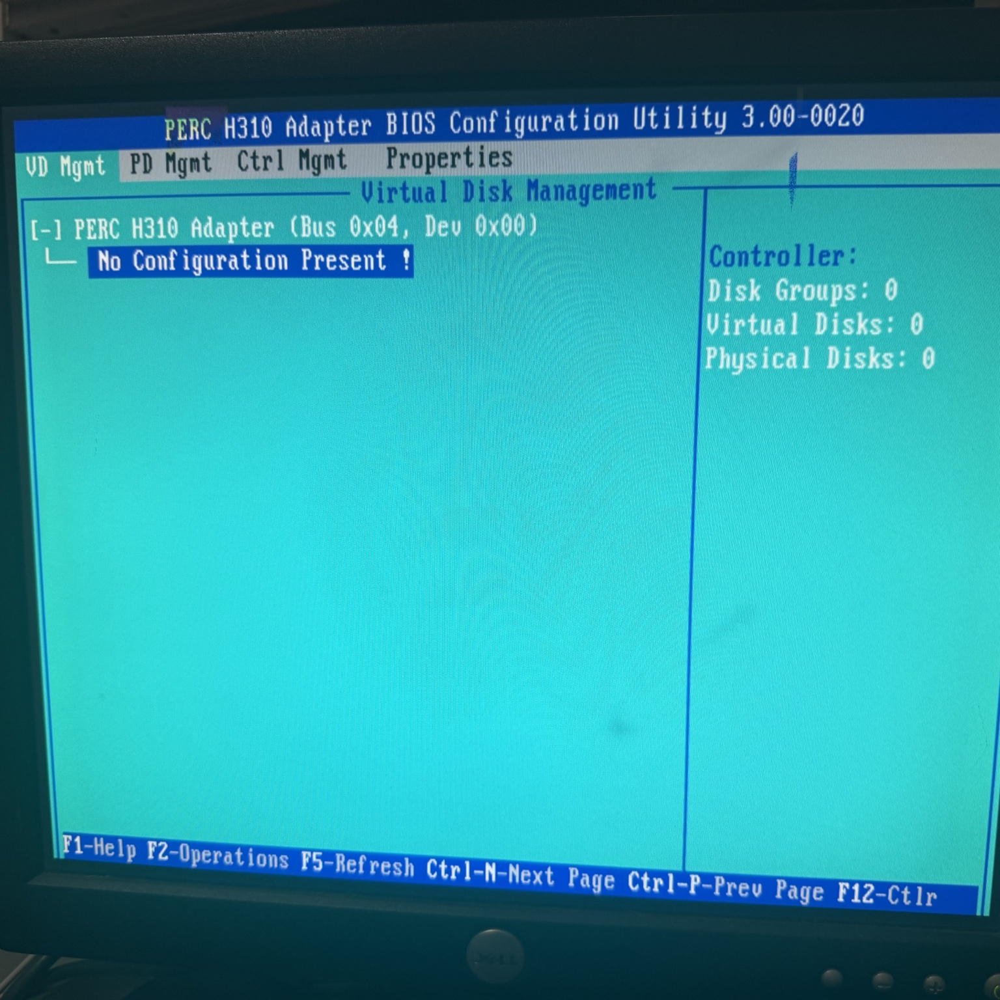
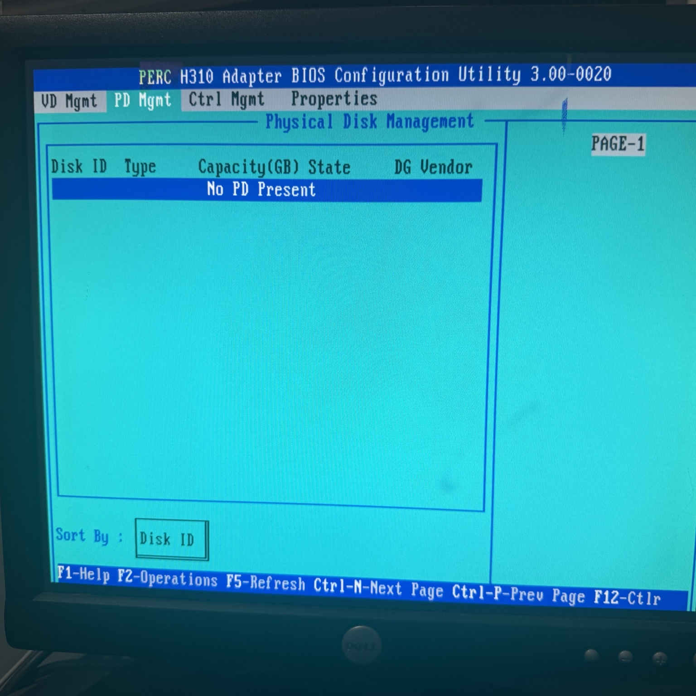
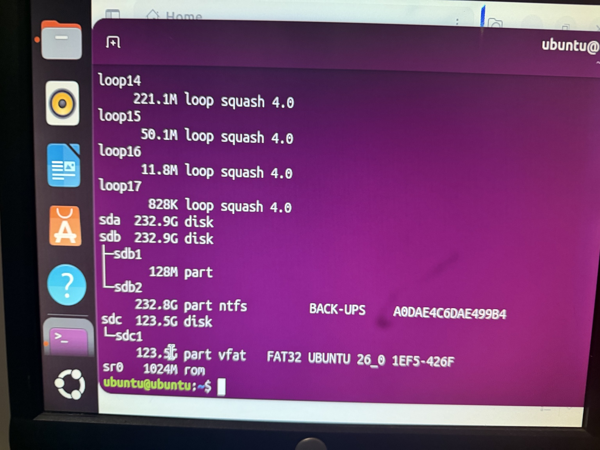
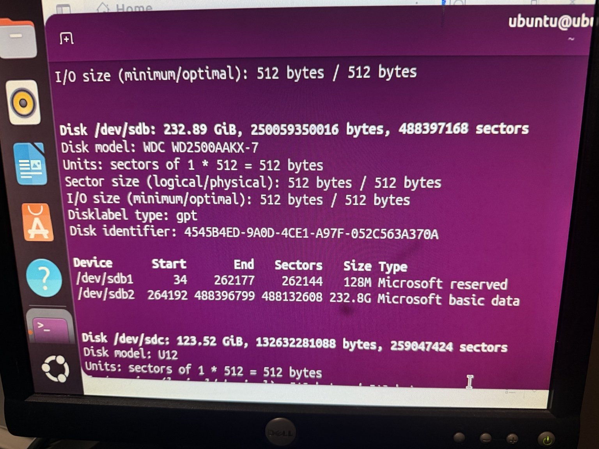
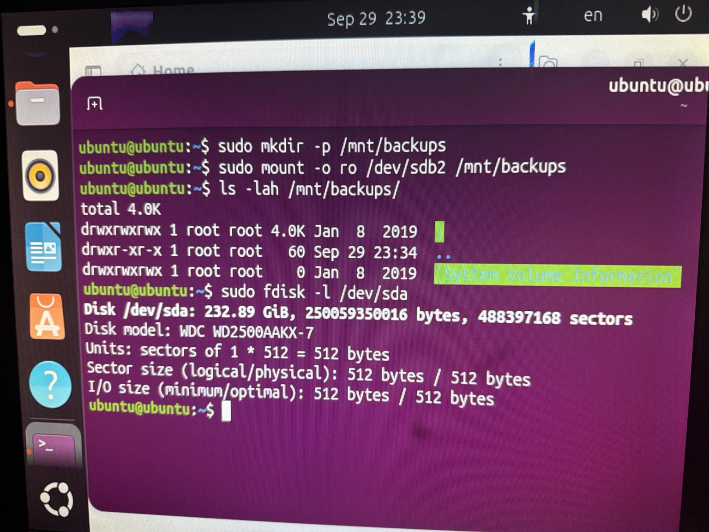

# Dell Precision Tower 5810: Initial Recovery and Storage Assessment

**Status:** Video output restored; CPU and RAM identified; HDD inspection completed. PERC H310 and the two HDDs removed, two SATA SSDs installed, and SATA mode changed to AHCI. Proxmox VE installation and ZFS mirror configuration remain pending.

## Overview

I began assessing this Dell Precision Tower 5810 for home lab use. At first, the fans spun but the workstation produced no video. Opening the chassis revealed that no memory was installed. After I installed two 32 GB DDR4 DIMMs, the machine produced video output and I could inspect its BIOS and storage settings.

The remaining boot failure was investigated separately. The two detected hard drives did not contain a bootable operating system during inspection.

## Hardware observed during assessment

| Component | Observed configuration |
| --- | --- |
| System | Dell Precision Tower 5810 |
| Processor | Intel Xeon E5-1620 v3 @ 3.50 GHz; four cores shown in BIOS |
| Memory | 64 GB DDR4 ECC RDIMM; two 32 GB modules in DIMM1 and DIMM2; BIOS-reported speed 2133; two active channels |
| Available DIMM slots | DIMM3–DIMM8 shown empty in the BIOS capture |
| BIOS | A09 |
| HDDs tested | Two WDC WD2500AAKX-75U6AA0 250 GB SATA HDDs, approximately 232.8 GiB each |
| Optical drive | PLDS DVD-ROM DS-8DBSH |
| Boot mode during inspection | Legacy |
| SATA operation during inspection | RAID On |
| Intel storage firmware | Intel Rapid Storage Technology enterprise SATA Option ROM 4.0.0.1016 |
| Installed operating system | No bootable OS found on the inspected HDDs |

These details describe the original assessment configuration. The BIOS system-information screenshot confirms the CPU, memory type, speed, DIMM placement, and BIOS version. Since that assessment, I have removed PERC and both HDDs, installed the two intended SATA SSDs, and changed SATA operation to AHCI. The HDD and RAID On entries above are historical.

## Recovery and inspection timeline

1. **No video:** The workstation powered on and its fans spun, but there was no display.
2. **Memory installation:** I found no RAM installed and added 64 GB DDR4. Video output returned.
3. **BIOS drive inspection:** BIOS detected two 250 GB WDC HDDs and the optical drive.
4. **Storage utilities:** Intel RSTe listed both HDDs as non-RAID disks with no RAID volumes defined. The PowerEdge RAID Controller (PERC) H310 utility showed no physical disks and no virtual-disk configuration during the assessment.
5. **PERC removal and retest:** I removed the H310 and restarted the workstation. Its initialization screen disappeared, while Intel RSTe continued to detect both HDDs. The system still reported no bootable device. This confirmed that the HDDs did not depend on PERC and that removing it did not resolve the boot failure.
6. **Live USB inspection:** I used Ubuntu from a live USB to inspect the drives without installing an operating system or creating a RAID array.
7. **Disk checks:** I installed `smartmontools` in the Ubuntu live session and checked both WD drives. Both passed the SMART tests I ran, with no issues reported in the reviewed logs.
8. **Hardware identification:** The BIOS system-information screen showed a Xeon E5-1620 v3, four cores, BIOS A09, and 64 GB DDR4 ECC RDIMM memory in DIMM1 and DIMM2 at a reported speed of 2133.
9. **Storage preparation:** With the H310 already removed, I removed both inspected HDDs and installed two 256 GB SATA SSDs for the intended Proxmox build. I changed the motherboard SATA mode from RAID On to AHCI.

The two storage utilities showed different device views: the HDDs were visible through the motherboard SATA/Intel storage path, while PERC showed no disks. A “RAID On” BIOS setting did not mean a RAID volume had already been created.

## Disk contents

| Device during the live session | Inspection result |
| --- | --- |
| `/dev/sda` | No partition table or partitions found |
| `/dev/sdb` | GPT partitioning with an NTFS volume labeled `BACK-UPS`; inspection found only `System Volume Information` |

Neither inspected HDD provided a bootable OS. Device names above identify the drives in that live session and may change in a later session.

## Troubleshooting evidence

The screenshots below follow the storage investigation from BIOS inspection through the Ubuntu live USB session. Each image opens at full size when clicked.

BIOS: boot sequence and SATA operation

I checked the boot configuration after video output returned. The boot-sequence screen shows Legacy mode selected and both WDC drives listed. A drive appearing in this list does not establish that it contains a bootable operating system.

I also checked SATA operation. This screen shows **RAID On** selected and explains that Disabled hides the integrated SATA controllers. This setting enables RAID support; it does not demonstrate that an array exists.

PERC: no virtual configuration or physical disks detected

The PERC H310 virtual-disk screen shows “No Configuration Present,” zero disk groups, zero virtual disks, and zero physical disks. I checked the physical-disk tab as well; it showed “No PD Present.”

These screens document PERC's view during the assessment. They do not mean the workstation had no HDDs: BIOS, Intel RSTe, and the later Ubuntu session detected the drives through the motherboard SATA path. After I removed the H310, its initialization screen disappeared and Intel RSTe still detected both HDDs. The card was therefore outside the active drive path; the no-bootable-device message persisted.

Ubuntu: drive inventory and GPT partition inspection

In the live USB session, the block-device listing showed two approximately 232.9 GiB HDDs. It showed no partitions under `sda`, while `sdb` had a 128 MiB partition and a larger NTFS volume labeled `BACK-UPS`. The Ubuntu USB appeared separately as `sdc`.

The `fdisk` output for `/dev/sdb` showed GPT partitioning, a 128 MiB Microsoft reserved partition, and a Microsoft basic-data partition occupying most of the disk. I used this inspection to understand the existing layout before deciding on an operating system or storage configuration.

Ubuntu: read-only volume inspection and unpartitioned drive

I mounted `/dev/sdb2` with the `ro` option and listed the root of the volume. The visible listing contained only `System Volume Information`, apart from the directory entries. This was a read-only check of the visible contents, rather than a recovery scan for deleted data.

The same screenshot shows `fdisk -l /dev/sda` reporting the drive's capacity and model without a partition table or partition entries.

The completed SMART checks are recorded from my reported results. These screenshots show the configuration and content inspection, rather than the SMART test logs.

## Result and interpretation

Missing RAM explained the initial lack of video: installing memory restored output and made further inspection possible. Removing the unused H310 left both HDDs accessible through Intel SATA. The inspected drives lacked a bootable operating system, explaining the remaining no-bootable-device message.

Both HDDs passed the reported SMART checks. These results support continued evaluation and noncritical lab testing, but sustained workload stability and the final workstation configuration have not been validated. I have not established that every hardware component is fault-free.

No operating system was installed, no drives were formatted, and no RAID volume was created during the live USB inspection. The later SSD installation and AHCI change prepared the workstation for the proposed deployment.

## Current configuration and planned deployment

I plan to use the T5810 as a secondary Proxmox VE host for larger VM groups and memory-intensive lab environments. The HP Z2 Mini G9 is intended to serve as the primary, more efficient compute host. The hardware preparation below is complete; Proxmox installation and ZFS configuration remain pending.

| Area | Configuration | State |
| --- | --- | --- |
| Processor | Intel Xeon E5-1620 v3 @ 3.50 GHz; four cores shown in BIOS | Identified |
| Memory | 64 GB DDR4 ECC RDIMM; 32 GB each in DIMM1 and DIMM2; reported speed 2133 | Installed and identified |
| BIOS | A09 | Identified |
| PERC H310 | Removed; previously confirmed outside the HDD drive path | Completed |
| Original HDDs | Both inspected 250 GB WD drives removed | Completed |
| SSDs | Two 256 GB SATA SSDs installed in place of the HDDs | Completed |
| SATA mode | Changed from RAID On to AHCI | Completed |
| Host role | Secondary Proxmox VE host | Planned |
| Boot layout | ZFS mirror across the two installed SSDs | Planned; not configured |
| VM storage | Allocation to be decided after the host is running | Pending |
| Additional memory | Possible expansion after compatibility checks | Planned; not installed |

### Remaining work

1. Install Proxmox VE using a ZFS mirror on the two installed SSDs.
2. Validate the installation, storage, and host stability, then decide on additional VM storage.
3. Record graphics and network-interface details; confirm the logical CPU count during host validation.
4. Verify compatibility before installing any additional DDR4 memory.

A possible additional 64–128 GB of DDR4 would bring the total to 128–192 GB if the modules and configuration are supported. This is a future possibility, rather than an installed or verified configuration.
